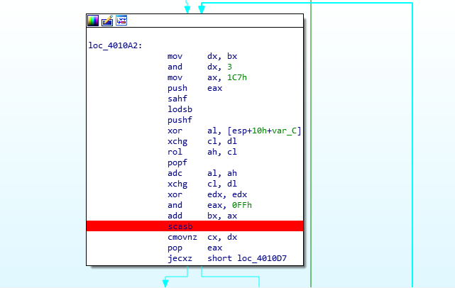
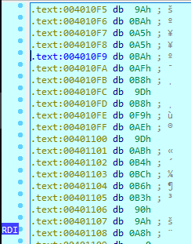

# Flare-On 2015

- [x] [Challenge 1](#challenge-1)
- [x] [Challenge 2](#challenge-2)
- [ ] Challenge 3
- [ ] Challenge 4
- [ ] Challenge 5
- [ ] Challenge 6
- [ ] Challenge 7
- [ ] Challenge 8
- [ ] Challenge 9
- [ ] Challenge 10
- [ ] Challenge 11

## Challenge 1

We get an executable file, analyzing it in IDA we see that there
are a bunch of values being XORed with `0x7d` and checked against 
user input. So I wrote this simple python script to extract the
flag.

```
unxored = [
    0x1f, 0x08, 0x13, 0x13, 0x04, 0x22, 0x0E, 0x11, 0x4D, 0x0D,
    0x18, 0x3D, 0x1B, 0x11, 0x1C, 0x0F, 0x18, 0x50, 0x12, 0x13,
    0x53, 0x1E, 0x12, 0x10
]

s = ''
for i in unxored:
    s += chr(i^0x7d)
print(s)
```

Flag: `bunny_sl0pe@flare-on.com`

## Challenge 2

In this challenge we get an executable binary. It prompts us for a
password and then checks it character-by-character against a bunch
of characters in memory. However, it is not a simple string
comparison.

The first thing that is checked in the validation function is the
length. It appears that the length of the password is `0x25` as
you can see below.


Then we the core logic of validating the password.



I'll explain what the block of code above does, but I definitely
recommend you to do it on your own, as long as you are familiar
with assembly and can understand unfamiliar instructions by
searching for them online.

So, what basically happens is that our input string is checked
against some transformation of the below dump in memory.



It starts from the bottom `0xA8`. The first input character that
we have gets XORed with a value `0xC7` (which is a constant XORed
value for all characters in our input string) and then some value
is added to the result of that XOR that is checked against the
memory dump.

The value to be added is determined by the sum of preceding bytes
in the dump. So, for the first byte, it is `1 + 1<<(sum&3)`. Here
I am oversimplifying it, but in actuality it has something to do
with add with carry.

Anyway, the reason why I recommended you to do this exercise on
your own is that it is very hard to explain in words. Below I've
added the python script that I came up with once I understood the 
block of assembly instructions.

```
x = [
    0xAA, 0xEC, 0xA4, 0xBA, 0xAF, 0xAE, 0xAA, 0x8A, 0xC0, 0xA7,
    0xB0, 0xBC, 0x9A, 0xBA, 0xA5, 0xA5, 0xBA, 0xAF, 0xB8, 0x9D,
    0xB8, 0xF9, 0xAE, 0x9D, 0xAB, 0xB4, 0xBC, 0xB6, 0xB3, 0x90,
    0x9A, 0xA8
]

y = x[::-1]

s = ''
bx = 0 # sum
dx = 0
ah = 1

for i in range(len(y)):
    dx = bx&3
    s += chr(0xc7^(y[i]-(((ah<<dx)&0xff)+1)))
    bx += y[i]
print(s)
```

Flag: `a_Little_b1t_harder_plez@flare-o`
